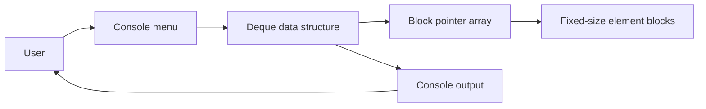

<div align="center">

# Deque

**C++ deque implementation that provides efficient front and back operations for dynamic data storage in a Windows console app**

[](https://www.microsoft.com/windows/)
[](https://isocpp.org/)
[](https://visualstudio.microsoft.com/vs/)
[](#-license--author)

</div>

---

<p align="center">
  
</p>

---

## 📌 Problem & Motivation

Many data structures need fast insertion and removal at both ends, but standard containers do not always provide the flexibility needed for custom block-based queue designs. A manual deque implementation helps demonstrate how memory can be organized efficiently while still keeping the API simple and usable.

**Deque** addresses this by combining a template-based data structure with a small interactive console interface:

- **⚡ Fast front/back access:** Add and remove data from both ends without reshaping the whole structure.
- **🧠 Efficient block storage:** Elements are stored in fixed-size blocks to manage dynamic growth in a clear way.
- **🛠️ Practical learning value:** The project is designed to be easy to inspect, test, and extend in C++.

---

## ✨ Key Features

- **⚡ Double-ended operations:** Supports insertion and removal from both the front and back.
- **📦 Block-based storage:** Organizes elements into fixed-size storage blocks for structured memory handling.
- **🔎 Indexed access:** Provides access, insertion, and deletion at arbitrary positions.
- **🧪 Console demo:** Lets users explore the deque through a simple interactive menu.
- **💡 Template design:** Works with different element types through the generic implementation.

---

## 🧠 Architecture & How It Works

The console menu in `main.cpp` interacts with the `Deque<int>` implementation, while the template logic in `Deque/Deque.h` manages block pointers, indexing, and storage layout.



## 🛠️ Tech Stack

| Category | Technology | Purpose / Highlights |
| --- | --- | --- |
| Language & Runtime | C++ 17 | Core data structure and console application logic. |
| IDE / Build Tool | Visual Studio 2022 + MSVC v143 | Windows-native C++ development and compilation. |
| Target Platform | Windows 10+ / x64 console app | Built for desktop C++ development environments. |
| Project Structure | `Deque/Deque.h`, `Deque/Deque.cpp`, `main.cpp` | Main implementation and demonstration entry point. |

## 🚀 Getting Started

### Prerequisites

- **Windows 10 or newer**
- **Visual Studio 2022**
- **Desktop development with C++** workload
- **MSVC v143** toolset
- **Windows 10 SDK**

### Install Visual Studio 2022

1. Download [Visual Studio 2022](https://visualstudio.microsoft.com/) from the official site.
2. Run the installer.
3. Select the **Desktop development with C++** workload.
4. In the installation details, ensure these components are included:
   - **MSVC v143 - VS 2022 C++ x64/x86 build tools**
   - **Windows 10 SDK**
5. Finish the installation and reopen Visual Studio.

### 1. Open the solution

Open `Deque.sln` in Visual Studio and choose a configuration such as **Debug** and a platform such as **x64**.

### 2. Build and run

Build the solution and run it with **Ctrl+F5** to start the console app without debugging. The menu allows you to test push, pop, insert, erase, and print operations.

### 3. Example usage

```cpp
#include "Deque/Deque.h"

int main() {
    Deque<int> values;
    values.push_back(10);
    values.push_front(5);
    values.insert(7, 1);

    int first = values.front();
    int last = values.back();
    int middle = values[1];

    values.pop_front();
    values.pop_back();
    return 0;
}
```

## 📄 License & Author

- **Author:** [Costin Ghiujan](https://github.com/coxteen)
- **License:** Released under the [MIT License](LICENSE).
